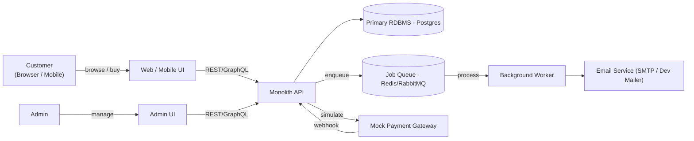

# 🌐 Context Diagram & System Boundaries

**Path:** `docs/architecture/context.md`

## 1. Context Diagram (Mermaid)

---

## 2. External Actors

- **User (Customer):** browses the product catalog, manages cart, places orders, and views order history.
- **Admin:** manages product catalog, monitors and updates order status.
- **Email Service:** external system (SMTP server, dev mailer) used to send confirmation and notification emails.
- **Mock Payment Gateway:** simulates payment flows during MVP stage, triggers callbacks (webhooks) to the API.

---

## 3. System Boundaries & Notes

- The system is implemented as a **modular monolith** for MVP.
  - Modules/domains: `auth`, `catalog`, `cart`, `orders`, `admin`, `jobs`.
- **Data storage:** all core data (users, products, carts, orders) resides in a single relational database (Postgres).
  - Strong consistency ensures inventory and orders are reliable.
- **Asynchronous work:** background tasks (e.g., sending emails, handling webhooks) are offloaded to a job queue (Redis or RabbitMQ) to avoid blocking user-facing API requests.
- **External integrations:**
  - Payment processing is simulated via a mock gateway (real gateway deferred).
  - Notifications limited to email in MVP (SMS/Push deferred).

---
