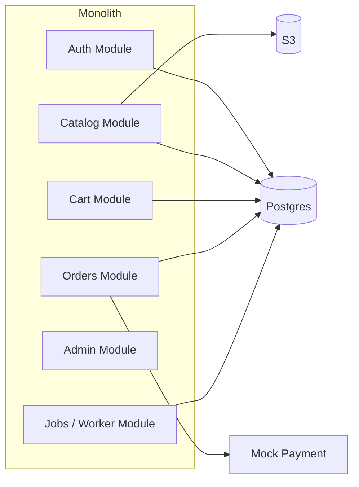

# 🔹 Component Diagram

**Path:** `docs/hld/component-diagram.md`

## Purpose

Zoom into the Monolith container and show major components / modules and their responsibilities.

## Component Diagram (Mermaid)

---

## Component responsibilities (brief)

- **Auth Module:** registration, login, JWT, refresh tokens, user profile.
- **Catalog Module:** product CRUD, categories, search index hooks, image metadata.
- **Cart Module:** cart lifecycle, guest merge, cart persistence.
- **Orders Module:** checkout transaction, order lifecycle, inventory decrement, idempotency handling.
- **Admin Module:** product management, order management, basic RBAC.
- **Jobs Module:** background workers for emails, webhook processing, and async tasks.
