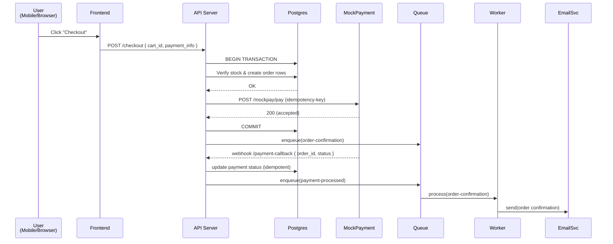

# 🔁 Data Flow & Sequence Diagrams

**Path:** `docs/hld/data-flow.md`

## Purpose

Describe key end-to-end flows and show sequence diagrams for critical scenarios to highlight transactions, idempotency, and failure handling.

## 1) Checkout Flow (Mermaid sequence diagram)

---

## Notes

- **Transactions:** checkout uses DB transaction to atomically create order and decrement stock.
- **Idempotency:** external payment callbacks should be idempotent (use idempotency keys or check prior state).
- **Async:** email sending is offloaded to workers to keep API responsive.
