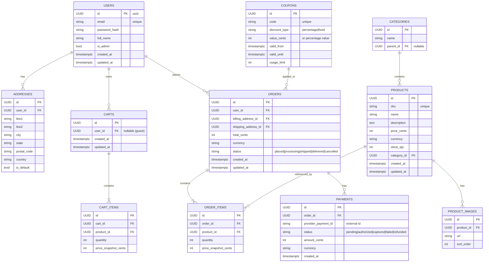

# 🗺️ ER Diagram — E-commerce (MVP) — Detailed Discussion

**Path:** `docs/lld/er-diagram.md`

---

## Overview (expanded)

This document is the canonical LLD artefact for Phase 2. It contains the ER diagram (Mermaid), and **detailed design commentary** on every entity, attribute, relationship, and the reasoning behind the choices. This version expands the earlier draft into a developer-friendly reference that should answer "why" as well as "what".

Use this as the single source of truth for schema discussions, migrations, and implementation decisions. After review we'll convert this into a `prisma/schema.prisma` and generate migrations.

---

## Mermaid ER Diagram (kept identical as canonical visual)



---

## Detailed entity discussion (attribute-by-attribute + rationale)

### USERS

- **id (UUID, PK)**: Use UUIDs for easy merging across environments and security (harder to enumerate). For small teams, sequential integers are fine, but UUIDs are preferred for distributed systems and portability.
- **email (unique)**: unique index for lookup; required for auth and notifications.
- **password_hash**: store only the salted hash (bcrypt/argon2). Never store plaintext or reversible encryption.
- **full_name**: user-facing name for display; optional to split into first/last if needed.
- **is_admin (bool)**: simple RBAC flag for MVP. For larger systems use roles table / permission model.
- **created_at / updated_at**: timestamps with timezone (Postgres `timestamptz`) for auditability.

**Indexes & constraints:** unique index on `email`, PK on `id`. Consider an index on `created_at` for querying recent signups.

**Privacy note:** email is PII. Apply appropriate retention policy and secure backups. Consider encrypting sensitive columns at rest if required.

---

### ADDRESSES

- **Purpose:** store multiple billing/shipping addresses per user. Keeping addresses separate avoids duplicating address data across orders and enables address reuse.
- **design:** `is_default` boolean helps pick quick shipping/billing address in UI. `user_id` FK enforces ownership.
- **Nullability:** fields like `line2` can be nullable.

**Constraints:** FK `user_id` references `users.id` (`ON DELETE CASCADE` is acceptable for dev but in prod prefer `ON DELETE SET NULL` or restrict/deactivate user account flow).

---

### CATEGORIES

- **Hierarchy:** parent_id supports nested categories (one-level or multi-level). For complex taxonomy use a separate taxonomy service or closure table (deferred).
- **Indexes:** index on `name` for admin lookup; consider a materialized view for category counts.

---

### PRODUCTS

- **sku (unique):** SKU is the business identifier — unique constraint enforced at DB level.
- **price_cents (int):** store money as integer (smallest unit, e.g., paise/cents) to avoid floating point issues.
- **currency (string):** ISO 4217 code (e.g., INR, USD). If multi-currency is not needed initially, default to project currency.
- **stock_qty (int):** simple quantity for MVP. For higher fidelity use inventory ledger or per-variant stock tables.
- **created_at / updated_at:** for auditing and display.

**Indexes & queries:** common query patterns are `WHERE category_id = ?` and `ORDER BY created_at` or `price`. Create composite indexes where needed, e.g., `(category_id, price_cents)` for price-range filters per category.

**Soft delete:** prefer `is_active` or `deleted_at` flag instead of hard delete to preserve historical integrity for orders that reference products.

**Variants:** product variants (size/color) are out of MVP scope. If needed, model `product_variants` with `sku`, `stock_qty`, and attributes.

---

### PRODUCT_IMAGES

- **Purpose:** link multiple images to a product; `sort_order` for display priority.
- **Storage:** store URL/metadata; actual content in S3. Consider an `is_primary` boolean as well.

---

### CARTS & CART_ITEMS

- **Carts.user_id nullable:** supports guest carts. Persist a `cart_id` in a secure, unguessable cookie (or in local storage for mobile) to identify guest cart.
- **price_snapshot_cents:** store price when item was added — protects users and business when prices change before checkout.
- **Merge strategy (guest→user):** on login, merge guest cart into user's existing cart: upsert items (sum quantities) and choose price_snapshot strategy (keep earliest/most recent as decided). Resolve conflicts with deterministic rules.

**Indexes:** FK on `cart_id`, composite index on `(cart_id, product_id)` to upsert efficiently.

---

### ORDERS & ORDER_ITEMS

- **Order as immutable record:** once placed, an order is a historical record. Order_items must keep snapshots for price and product metadata if needed (name, sku) to prevent surprises when product metadata changes.
- **status:** simple state machine for MVP. Consider recording change history (order_events) for audits.
- **billing/shipping address:** store `address_id` as FK. Alternatively, copy address fields into order for immutability; both approaches are valid — copying avoids FK lifetime issues.

**Cascade rules:** don't cascade-delete orders when user deleted. Prefer `ON DELETE SET NULL` or disallow deleting user in prod.

---

### PAYMENTS

- **Multiple payments per order:** design as 1-to-many to support partial captures and refunds later.
- **provider_payment_id:** external ID from provider (Stripe/Adyen) used for reconciliation. **Enforce uniqueness per provider** to prevent duplicate processing.
- **status enum:** capture lifecycle from `pending` to `captured` or `failed`. Ensure idempotent updates when receiving webhooks.

**Security:** validate webhook signature (HMAC) and use idempotency keys to avoid double-processing.

---

### COUPONS

- **Validation logic:** coupon application is primarily application-level logic (eligibility, usage limits, stacking). Keep coupon metadata in DB; compute effects at checkout time and store applied coupon details on the order.
- **Usage limits:** consider a `usage_count` increment operation guarded by a transaction to prevent over-redemption — or use a separate `coupon_redemptions` table to track per-user redemptions.

---

## Relationships & Cardinalities (detailed)

- **Users 1 — \* Addresses** (`users.id` → `addresses.user_id`): one-to-many; a user can have multiple addresses.
- **Users 1 — \* Carts**: allow multiple carts for historical reasons; normally each user has one active cart.
- **Carts 1 — \* CartItems**: cart contains many items; `cart_items` references `product_id`.
- **Categories 1 — \* Products**: simple category containment; variant mapping deferred.
- **Users 1 — \* Orders**: user places many orders; order history is essential for UX.
- **Orders 1 — \* OrderItems**: order has many items; items are immutable snapshots.
- **Orders 1 — \* Payments**: multiple payments per order possible.

**Cardinality notes:** choose FK constraints and `ON DELETE` behaviors carefully: do not cascade deletes from `products` to `order_items` — historical integrity matters.

---

## Indexing strategy & expected query patterns

Design indexes to satisfy these queries to start:

1. Product listing: `WHERE category_id = ?` with pagination and optional price range. Index: `(category_id, price_cents, id)`.
2. Product lookup: `WHERE sku = ?` or `WHERE id = ?` → unique index on `sku` and PK on `id`.
3. User lookup: `WHERE email = ?` → unique index on `email`.
4. Cart operations: fast lookup by `cart_id` and `user_id` → index on `cart_id`, index on `(user_id, updated_at)`.
5. Orders by user: `WHERE user_id = ? ORDER BY created_at DESC` → index `(user_id, created_at)`.
6. Payments by provider_payment_id: unique index `(provider_payment_id, provider_name)` if storing multiple providers.

Avoid over-indexing early; add indexes as the slow queries appear in profiling.
Use `EXPLAIN` to verify plans after implementing queries.

---

## Transactions, concurrency & preventing oversell (detailed)

Checkout flow must be atomic for correctness. Recommended pattern (Postgres):

1. Start DB transaction.
2. Lock product rows you plan to decrement (e.g., `SELECT stock_qty FROM products WHERE id = $1 FOR UPDATE`).
3. Verify `stock_qty >= requested_qty` for each item.
4. Insert `order` + `order_items` rows.
5. Decrement `products.stock_qty = products.stock_qty - qty`.
6. Commit transaction.

**Alternative approaches:** optimistic locking (version/timestamp column) with retries, or an inventory ledger (append-only) for higher scale. For MVP, `SELECT ... FOR UPDATE` inside transaction is simplest and reliable.

**Idempotency:** ensure the checkout endpoint accepts an `idempotency_key` to prevent duplicate orders caused by client retries. Store the idempotency key with the order or a separate table to lookup completed requests.

---

## Payment webhook handling & idempotency

- **Webhook security:** sign payloads and verify using provider HMAC secret to prevent spoofing.
- **Idempotency processing:** when webhook arrives, find payment by `provider_payment_id` or `webhook_id` and ignore duplicates.
- **State transitions:** update `payments.status` and `orders.payment_status` transactionally where possible, but handle webhook retries gracefully (idempotent updates).

---

## Denormalization & snapshots (why we store snapshots)

- **Why snapshot price and other fields?** Product metadata and prices change over time; orders must reflect historical purchase state. `price_snapshot_cents`, `product_name_snapshot`, `sku_snapshot` on `order_items` ensure invoice accuracy and auditing.
- For MVP we store `price_snapshot_cents`. Consider adding `product_name_snapshot` / `sku_snapshot` if product names frequently change or legal receipt needs them.

---

## Soft deletes, archival & retention

- **Products:** use `is_active` or `deleted_at` for soft deletes to keep historical orders intact.
- **Orders:** keep orders immutable; prefer `status = cancelled` instead of deletion. Archive old orders to a read-only archive partition or export for compliance if needed.
- **Retention:** define policies for personal data retention and deletion (GDPR-like concerns). Remove or anonymize data after retention period if required.

---

## Auditability & logging

- Keep `created_at` / `updated_at`. For higher audit needs, maintain `order_events` or `audit_logs` capturing who changed what and when.
- Application logs should include request IDs and user IDs for traceability across services and workers.

---

## Sample PostgreSQL DDL snippets (starter)

> These are simplified snippets to illustrate table shapes; final schema will be generated via Prisma migration.

```sql
CREATE TABLE users (
  id UUID PRIMARY KEY DEFAULT gen_random_uuid(),
  email TEXT UNIQUE NOT NULL,
  password_hash TEXT NOT NULL,
  full_name TEXT,
  is_admin BOOLEAN DEFAULT FALSE,
  created_at timestamptz DEFAULT now(),
  updated_at timestamptz DEFAULT now()
);

CREATE TABLE products (
  id UUID PRIMARY KEY DEFAULT gen_random_uuid(),
  sku TEXT UNIQUE NOT NULL,
  name TEXT NOT NULL,
  description TEXT,
  price_cents BIGINT NOT NULL,
  currency CHAR(3) NOT NULL,
  stock_qty INT NOT NULL DEFAULT 0,
  category_id UUID REFERENCES categories(id),
  created_at timestamptz DEFAULT now(),
  updated_at timestamptz DEFAULT now(),
  is_active BOOLEAN DEFAULT TRUE
);

CREATE TABLE orders (
  id UUID PRIMARY KEY DEFAULT gen_random_uuid(),
  user_id UUID REFERENCES users(id),
  billing_address_id UUID REFERENCES addresses(id),
  shipping_address_id UUID REFERENCES addresses(id),
  total_cents BIGINT NOT NULL,
  currency CHAR(3) NOT NULL,
  status TEXT NOT NULL,
  created_at timestamptz DEFAULT now(),
  updated_at timestamptz DEFAULT now()
);
```

---

## Seed data (expanded examples)

**products.csv**

```csv
id,sku,name,description,price_cents,currency,stock_qty,category_id,created_at,updated_at
11111111-1111-1111-1111-111111111111,SKU-001,Sample T-Shirt,"A comfy shirt",1999,INR,100,22222222-2222-2222-2222-222222222222,2025-09-06T00:00:00Z,2025-09-06T00:00:00Z
```

**users.csv**

```csv
id,email,password_hash,full_name,is_admin,created_at,updated_at
33333333-3333-3333-3333-333333333333,alice@example.com,$2b$12$...,Alice,false,2025-09-06T00:00:00Z,2025-09-06T00:00:00Z
```

**addresses.csv**

```csv
id,user_id,line1,line2,city,state,postal_code,country,is_default
44444444-4444-4444-4444-444444444444,33333333-3333-3333-3333-333333333333,"123 Main St","",Mumbai,Maharashtra,400001,IN,TRUE
```

**coupons.csv**

```csv
id,code,discount_type,value_cents,valid_from,valid_until,usage_limit
55555555-5555-5555-5555-555555555555,SAVE10,percentage,10,2025-01-01T00:00:00Z,2026-01-01T00:00:00Z,1000
```

---

## Migration & evolution guidance (how to change schema safely)

- **Additive changes** (new columns, new tables) are safe and should be deployed first. Backfill data in a separate migration job if needed.
- **Destructive changes** (drop columns/tables, change column types) require careful procedure: deploy compatible code path, backfill, migrate clients, then remove old columns.
- **Versioned APIs / backwards compatibility:** since multiple frontends may exist, keep old fields until clients migrate. Use feature flags if necessary.
- **Prisma note:** Prisma migrations generate SQL. Keep migrations small and test them on staging before production.

---

## Operational & monitoring considerations

- **Slow queries:** track with `pg_stat_statements`. Add indexes based on real query shapes.
- **Deadlocks / contention:** monitor `pg_locks` and design transactions to acquire locks in consistent order. Keep transactions short.
- **Backups:** enable point-in-time recovery; test restores periodically.

---

## Open design questions & trade-offs for review

1. **Product variants now or later?** If product variations (size/color) are required, add `product_variants` table now to avoid later refactor. For MVP, defer to simplify UX.
2. **Address storage on orders:** copy address into `orders` (denormalized) for immutability vs `address_id` FK that could be deleted. Recommendation: copy address fields into order (one-time cost) for stronger immutability.
3. **Currency / multi-region:** start with single currency to simplify bookkeeping; migrate to multi-currency when business needs arise.
4. **Inventory strategy:** For large-scale marketplaces, move to inventory ledger and eventual consistency; for MVP use `SELECT ... FOR UPDATE` in transactions.

---

## Next steps (concrete)

1. Review this detailed doc and comment on open questions above (variants, address copy policy, currency).
2. I will convert this schema to a `prisma/schema.prisma` and propose migration SQL.
3. Create seed CSV files in `ecommerce-backend/seed/` and update `docker-compose.dev.yml` to load seed data.
4. Implement a checkout POC using the transaction pattern + idempotency key and add tests for oversell scenarios.

---

_Generated on 2025-09-14T13:22:38.269389_
