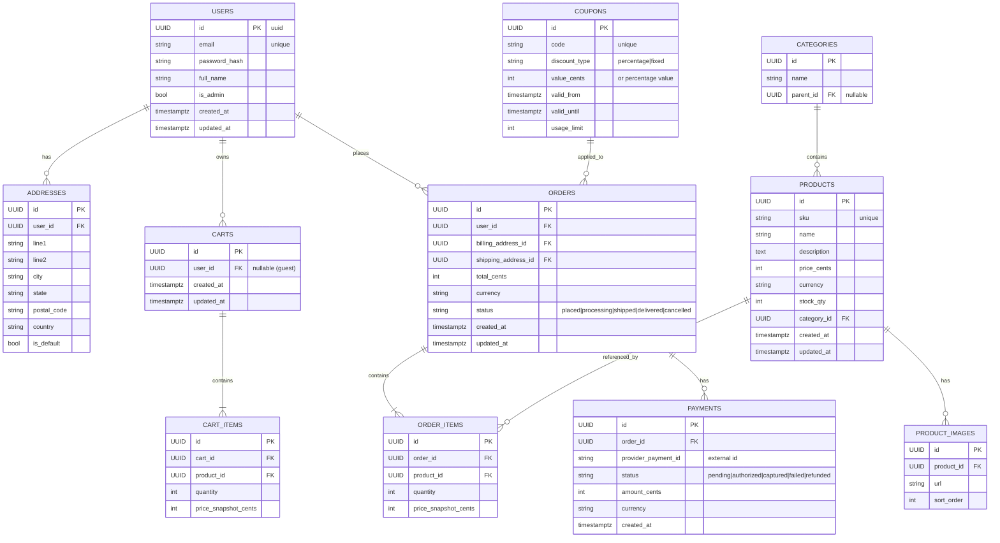

# 🗺️ ER Diagram — E-commerce (MVP)

**Path:** `docs/lld/er-diagram.md`

## Overview
This file contains the canonical ER diagram for the Phase 2 LLD. It captures the main entities for the MVP and their relationships: **Users, Products, Categories, Carts, Orders, Payments**, and supporting entities like product images, addresses, and coupons.

Use this as the single source of truth for the schema design. The diagram is expressed in **Mermaid** (entityDiagram) so it can be rendered in Markdown viewers that support Mermaid. A short textual explanation follows the diagram that highlights key cardinalities and important design notes.

## Mermaid ER Diagram



---

## Key cardinalities & notes
- **Users ↔ Addresses:** 1-to-many (a user may have multiple addresses). Use `is_default` to quickly pick billing/shipping address.
- **Users ↔ Carts:** 1-to-many where carts.user_id may be `NULL` for guest carts. Merge guest cart into user cart on login/registration.
- **Carts ↔ CartItems:** 1-to-many. `price_snapshot_cents` saves the price at the time of adding to cart (protects against price changes).
- **Orders ↔ OrderItems:** 1-to-many. Orders store `price_snapshot_cents` for historical accuracy and auditing.
- **Products stock_qty:** single integer for MVP. Update within transactional checkout to avoid oversell; consider optimistic locking (`version` column) if scaling.
- **Payments ↔ Orders:** 1-to-many to support partial captures/refunds in future. Payments reference `provider_payment_id` for reconciliation.
- **Coupons:** simple model included; validation rules (stacking, per-user limits) implemented at application logic level.

## Design trade-offs / rationale
- **Normalized design (3NF):** avoids duplication; snapshots (price_snapshot_cents) intentionally denormalize price for auditing.
- **Monolith-friendly:** Schema keeps strong transactional patterns for checkout — single DB ensures ACID semantics for order creation and inventory decrement.
- **Extensibility:** payments and coupons are modeled to allow expansion (multiple payment attempts, partial refunds, multi-apply rules) without breaking core order model.

## Seed data (example rows)
Below are minimal CSV-style sample rows for local dev to help populate the DB quickly.

**products.csv**
```csv
id,sku,name,description,price_cents,currency,stock_qty,category_id,created_at,updated_at
11111111-1111-1111-1111-111111111111,SKU-001,Sample T-Shirt,"A comfy shirt",1999,INR,100,22222222-2222-2222-2222-222222222222,2025-09-06T00:00:00Z,2025-09-06T00:00:00Z
```

**users.csv**
```csv
id,email,password_hash,full_name,is_admin,created_at,updated_at
33333333-3333-3333-3333-333333333333,alice@example.com,$2b$12$...,Alice,false,2025-09-06T00:00:00Z,2025-09-06T00:00:00Z
```

**categories.csv**
```csv
id,name,parent_id
22222222-2222-2222-2222-222222222222,Apparel,
```

## Next steps (after ER)
1. Review and approve the ER diagram and entity attributes.
2. Convert ER into normalized Prisma schema (`prisma/schema.prisma`) and generate migrations.
3. Add sample seeds to `ecommerce-backend/seed/` and wire them into `docker-compose.dev.yml` for local dev.

---

*Generated on 2025-09-14T12:47:01.473432*
